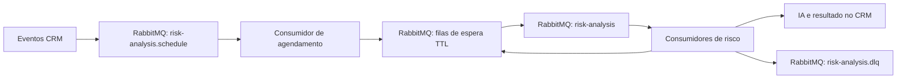

# Análise de risco com espera no RabbitMQ

## Comportamento

Uma atualização recebida agenda o risco da oportunidade. Cada alteração nova reinicia `debounce_minutes` conforme a configuração efetiva da empresa (mínimo 1 minuto). Depois da espera, um consumidor busca o contexto atual e executa a análise. Sem eventos novos, nenhuma análise é criada pelo relógio.

Exemplo: atualização às 10:00:00, intervalo de 1 minuto e outra atualização às 10:00:40 tornam a análise elegível às 10:01:40. Atrasos de entrega/capacidade do broker podem postergar a execução. Versões antigas e trabalhos já concluídos são descartados antes da chamada à IA. O agente desabilitado e oportunidades encerradas também não são analisados.

## Fluxo e filas

Os nomes recebem `prd.`/`tst.` como as demais filas. Prefixo base configurável: `RabbitMQ__RiskAnalysisQueue` (padrão `crm.projections.risk-analysis`).

- `.schedule`: pedidos duráveis aguardando consolidação.
- `.delay.<segundos>s`: mensagens aguardando prazo ou nova tentativa.
- Fila base: trabalhos prontos para validar e executar.
- `.dlq`: mensagens inválidas, falhas definitivas e tentativas esgotadas.

O payload transporta identificadores e metadados do evento. Textos das conversas e o contexto comercial são consultados no momento da análise, evitando replicar esses dados nas mensagens.

Não há timer consultando pendências no PostgreSQL. A entrega do broker ativa os consumidores. A espera usa nove filas de TTL fixo (1, 10, 60, 300, 900, 1800, 3600, 21600 e 86400 segundos), compartilhadas entre todas as oportunidades, sem criar uma fila por contato/empresa. Prazos intermediários passam por mais de uma faixa. Enquanto o prazo do envelope não venceu, o consumidor o devolve à faixa apropriada sem consultar o estado no banco.

Essa separação evita bloqueio de prazos curtos atrás de mensagens com TTL longo na mesma fila. Referência: [TTL e expiração no RabbitMQ](https://www.rabbitmq.com/docs/ttl).

## Papel do banco

`risk_analysis_state` contém uma linha por empresa/oportunidade: versão atual, versão concluída, prazo e reserva temporária de execução. `risk_analysis_event_receipts` contém apenas identificadores de eventos já registrados e suas versões para idempotência. As consultas são pontuais por chaves indexadas; não existe seleção periódica de filas vencidas, armazenamento de payload, nem lista de tentativas pendentes no banco.

Os recibos persistem para reconhecer reentregas antigas; continuam sendo metadados com custo de armazenamento e escrita, não uma eliminação completa do uso do banco. Sua exclusão deve respeitar a janela operacional de replay. Não há limpeza automática que possa transformar uma reentrega antiga em nova análise. A exclusão de um estado remove os respectivos recibos por chave estrangeira.

## Consistência e recuperação

1. O consumidor do evento CRM só retorna após confirmação de publicação do pedido no broker.
2. O agendador registra a versão/prazo, publica a mensagem de espera com confirmação e então confirma o pedido recebido.
3. Se houver interrupção entre registrar a versão e publicar, o pedido continua no RabbitMQ. A reentrega recupera a mesma versão e o mesmo prazo, republicando o aviso. Não exige varredura de outbox.
4. Na execução, reserva e verificação de versão são atômicas por oportunidade. Réplicas diferentes podem processar oportunidades distintas; duplicatas da mesma oportunidade não executam simultaneamente enquanto a reserva estiver válida.
5. Atualizações durante a análise geram nova versão e novo aviso no broker. A conclusão antiga não apaga a nova versão.
6. O consumidor confirma a mensagem após persistir a conclusão ou confirmar seu encaminhamento para espera/DLQ. Falhas de infraestrutura preservam a entrega no broker e usam intervalo de reconexão/reentrega.

A reserva dura 10 minutos e a chamada tem limite de 5 minutos. Leases abandonados são retomados quando uma entrega chega novamente. Falhas transitórias têm no máximo três aquisições de execução por versão; a espera entre tentativas é de 5 minutos no broker. Saldo esgotado e erros definitivos vão para DLQ. A reserva e o contador impedem que mensagens duplicadas reiniciem o orçamento de tentativas da mesma versão.

Mensagens inválidas não ficam em ciclo de reentrega. A infraestrutura permite até 1.000 reentregas antes de encaminhar para DLQ; esse limite é separado das três tentativas da IA. A DLQ precisa de acompanhamento operacional. Um replay de uma versão terminal deve ser feito como novo pedido com novo `EventId`, mantendo a identificação da oportunidade; simplesmente recolocar o envelope concluído na fila não refaz a análise.

Publicação utiliza mensagens persistentes, `mandatory` e publisher confirms. Filas quorum e dead-lettering `at-least-once` mantêm a mensagem de espera até confirmação do destino. Referências: [confirmações](https://www.rabbitmq.com/docs/confirms) e [quorum/dead-lettering](https://www.rabbitmq.com/docs/3.13/quorum-queues).

Uma interrupção após resposta do provedor e antes de persistir a conclusão ainda pode exigir reprocessamento. Não há garantia de cobrança exatamente uma vez entre IA, broker e banco.

## Escala e implantação

`RabbitMQ__RiskAnalysisConsumerCount` controla executores por réplica (padrão 2; máximo 32). `RabbitMQ__RiskAnalysisSchedulerCount` controla agendadores por réplica (padrão 1; máximo 32). Ambos aceitam zero para separar esses papéis entre implantações, desde que haja agendadores e executores ativos no conjunto. Os demais hosted services continuam seguindo suas próprias configurações existentes; estes parâmetros não transformam a aplicação inteira em um serviço exclusivo de risco.

Cada executor usa canal próprio e prefetch 1. Aumentar executores/réplicas distribui a fila compartilhada; deve considerar o limite de chamadas simultâneas e tokens da IA. Monitorar `.schedule`, fila base, filas de espera, mensagens sem ACK e DLQ, além da latência e contadores por agente. Os testes funcionais não substituem um teste de carga para dimensionar produção.

Topologia validada em RabbitMQ 3.13 com quorum queues; não requer plugin de delayed messages. O usuário do broker deve poder declarar as filas/exchanges e publicar/consumir. Para tolerância a falhas de nós, a configuração/replicação do cluster RabbitMQ continua necessária.

A migração `database/20260909_create_risk_analysis_state.sql` é embutida e aplicada de forma idempotente na inicialização. Substitui a implementação local anterior, que usava PostgreSQL como fila. Não há DROP automático de estruturas ou mensagens de versões anteriores. Nenhuma infraestrutura de produção foi alterada nesta implementação.

## Testes

A suíte cobre reinício do prazo, reentrega, recuperação da publicação após commit, versões superadas, concorrência, isolamento de empresa/oportunidade, alterações durante execução, falhas e limites de tentativas. Os testes reais RabbitMQ cobrem TTL/DLX, persistência das mensagens, reentrega ao fechar canal sem ACK, DLQ e execução pelos consumidores reais com IA simulada.

Para rodar a integração, definir `RISK_ANALYSIS_TEST_DATABASE` para uma base descartável chamada `risk_delay_test` e `RISK_ANALYSIS_TEST_RABBITMQ` para um broker descartável. Os testes de estado truncam somente as tabelas de metadados dessa base. Sem as variáveis, os testes de integração são explicitamente ignorados.

O teste de recuperação com destino indisponível aceita até 210 segundos, pois o RabbitMQ 3.13 usa por padrão 180 segundos para confirmação interna do dead-letter worker. A mensagem permanece retida nesse intervalo. Na validação local, esse timeout foi reduzido para 1 segundo apenas no broker descartável (`application:set_env(rabbit, dead_letter_worker_publisher_confirm_timeout, 1000)`). Não é uma alteração da configuração de produção.
